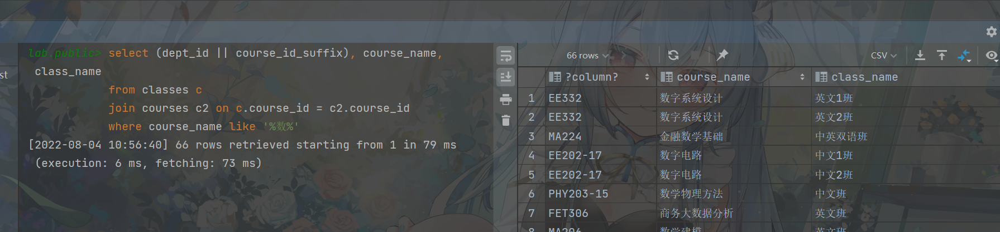
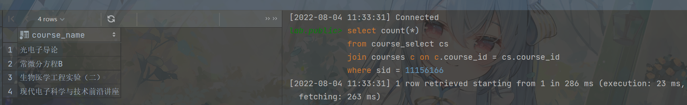
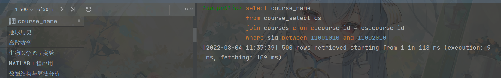
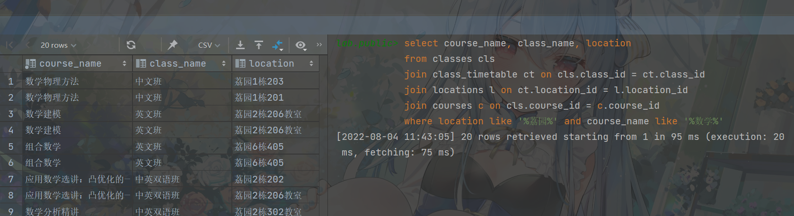
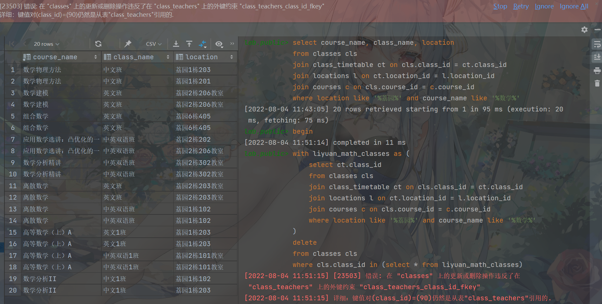
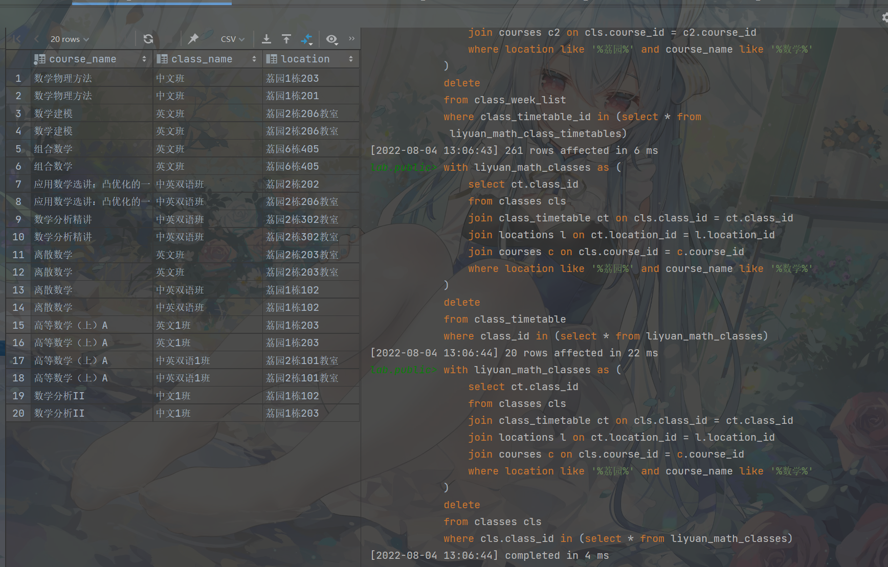
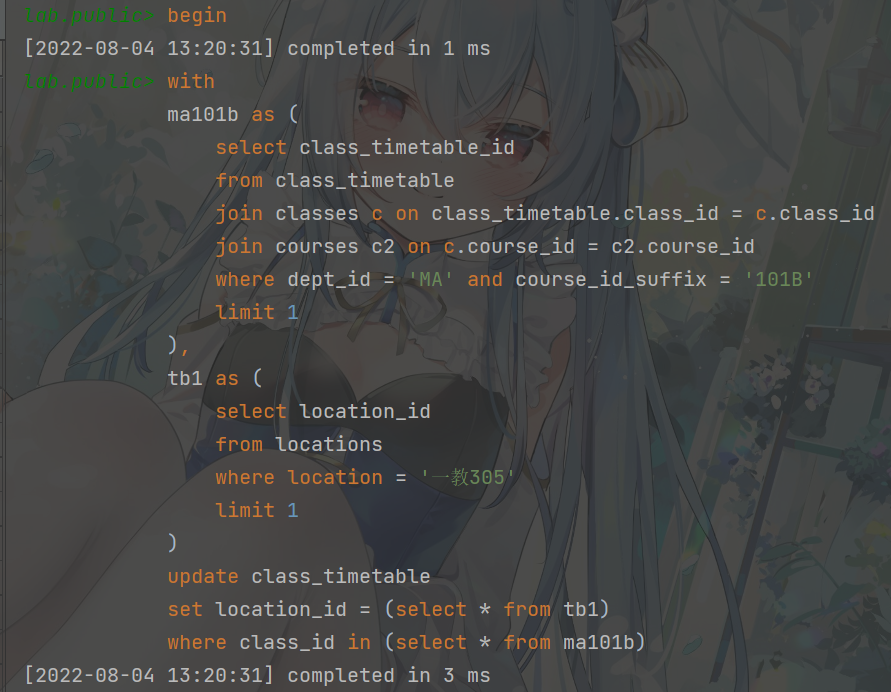
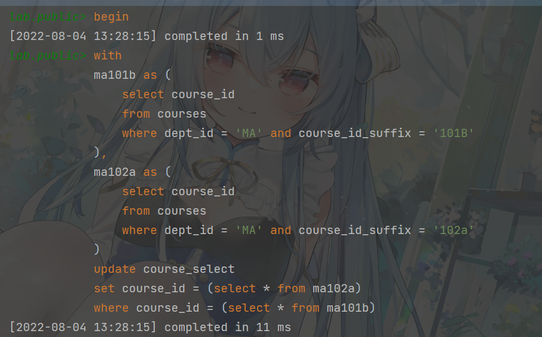
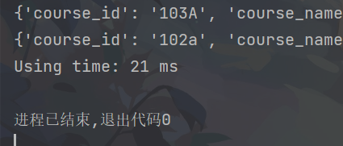
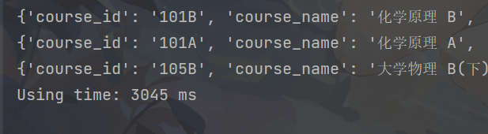

# CS213 Project Report
by 12110631 龚凌琥

## Database Structure
### Task 5 Database

以下为表的大致功能介绍。Task6完成的接口中并未覆盖到所有的相关字段，存在一定量的冗余数据，可供以后进行接口拓展。

| Table           | Description                                                               | Foreign Key                    |
|-----------------|---------------------------------------------------------------------------|--------------------------------|
| courses         | 存储某个课程（对应接口`Course`）的相关数据                                                 | dept_id                        |
| classes         | 存储某个课程班级（对应接口`CourseSection`）的相关数据                                        | course_id, semester_id         |
| class_timetable | 存储某个课程班级课程时间（对应接口`courseSectionClass`）的相关数据                               | location_id, class_id          |
| class_teachers  | 存储某个课程班级课程时间的老师的相关数据，以联合主键`(class_timetable_id, teacher_id)`约束            | class_timetable_id, teacher_id |
| class_week_list | 存储某个课程班级课程时间的对应教学周的相关数据                                                   | class_timetable_id             |
| students        | 存储学生的相关数据                                                                 | ad_class_id, major_id, user_id |
| course_select   | 存储学生选课的相关数据                                                               | sid, class_id                  |
| teachers        | 存储老师（对应接口`Instructor`）相关的数据。考虑接口中`Instructor` 继承自 `User·, 主键记录为 `user_id` | N/A                            |  
| ad_classes      | 存储学生行政班对应的信息。由于原始数据`student.csv`中行政班具有中英文名，分为两个字段记录。                      | N/A                            |
| departments     | 存储学校院系的相关数据                                                               | N/A                            |
| majors          | 存储学校专业的相关数据                                                               | dept_id                        |
| course_type     | 存储某个专业划分某个课程的课程类型的相关数据                                                    | course_id, major_id            |
| semesters       | 存储学期的相关数据                                                                 | N/A                            |
| locations       | 存储地点的相关数据                                                                 | N/A                            |

接下来对列的特殊考虑进行描述。

- `classes.left_capacity`: 在最开始的设计中，考虑到剩余课程容量可以通过聚合函数从`course_select`中计算得出，属于派生属性，并未考虑实际存在。但在进行接口实现时，发现实际上`course_select`表的数据量非常巨大，并且`addEnrolledCourseWithGrade`接口登记的学生课程不占用课程容量，使用聚合函数进行统计时造成了很大的性能瓶颈，因此考虑使用空间换取时间，在进行课程登记的时候更新该字段。

### Task 1 Database

相比Task5中的数据库，Task1的数据库缺少了以下表：
- semesters: 学期数据
- majors: 专业信息
- course_type: 专业对课程的分类

某些表中缺省了以下字段：
- students: `major_id`, `first_name`, `last_name` (`name`被合并为`student_name`), `enrolled_date`
- teachers: `first_name`, `last_name`(`name`被合并为`teacher_name`)

同时某些表添加了以下字段
- courses.course_id_suffix: 由于南科大课程id的字母前缀带有开课院系信息，课程id的前缀或许会成为冗余数据，在Task1设计数据库时我尝试将课程id拆分为院系id和课程id后缀（如`CS102A->{dept_id: CS, course_id_suffix: 102A}`），同时使用联合联合主键限制课程id唯一。但后续的接口开发中发现保证课程id的完整性更有助于编写代码，遂在Task5修改数据库的过程中保留了完整的`course_id`。

此外，`class_teachers`中的外键约束也从指向`class_timetable_id`改为`class_id`，因为`course_info.json`中并没有对课程时间进行老师的区分。

## Data Importer Design
我使用了Python开发导入数据的脚本，主要使用了`psycopg`模块连接数据库，`json`模块对`course_info.info`进行解析，`select_course.csv`则直接使用文件IO进行字符串处理。

脚本分为两个模块，`course_import.py`和`student_import.py`，以下为部分核心代码

```python
# course_import.py
import psycopg

departments = []
teachers = ['null']
locations = []
course_ids = []
courses = []

# ...
# 对json进行数据预处理

with psycopg.connect('host=localhost port=5432 dbname=cs213project '
                     'user=postgres password=0906KOORI') as conn:
    with conn.cursor() as cur:
        for i, department in enumerate(departments):
            cur.execute("insert into departments (dept_id, department) values(%d, '%s')" %
                        (i, department))

        cur.execute("insert into teachers (teacher_id, name) values(0, null, null)")
        for i, teacher in enumerate(teachers):
            cur.execute("insert into teachers "
                        "(user_id, first_name, last_name) "
                        "values(%d, '%s', '%s')" %
                        (i + 1, teacher))

        for i, location in enumerate(locations):
            cur.execute("insert into locations (location_id, location) values(%d, '%s')" % (i, location))

        for i, course in enumerate(courses):
            cur.execute("insert into courses (course_id,  dept_id, "
                        "course_name, credit, hour, prerequisite)"
                        "values ('%s', %d, '%s', %d, %d, %s)" %
                        (
                            course['course_id'],
                            course['course_dept_id'],
                            course['course_name'],
                            course['credit'],
                            course['hour'],
                            'null' if course['prerequisite'] is None else ("'%s'" % course['prerequisite']))
                        )

        tt_id = 0
        for i in range(len(course_info)):
            cur.execute("""
                        insert into classes (class_id, course_id, class_name, capacity, semester_id)
                                    values (%d, '%s', '%s', %d, %d)
                        """ %
                        (
                            i,
                            course_info[i]['courseId'],
                            course_info[i]['className'].strip(),
                            course_info[i]['totalCapacity'],
                            0
                        ))

            for cl in course_info[i]['classList']:
                cur.execute('insert into class_timetable '
                            '(class_timetable_id, class_id, location_id, time_begin, time_end, weekday) '
                            'values(%d, %d, %d, %d, %d, %d)' %
                            (
                                tt_id,
                                i,
                                locations.index(cl['location']),
                                int(cl['classTime'].split('-')[0]),
                                int(cl['classTime'].split('-')[1]),
                                cl['weekday']
                            ))
                for w in cl['weekList']:
                    cur.execute('insert into class_week_list (class_timetable_id, week) '
                                'values(%d, %d)' %
                                (tt_id, int(w)))
                if course_info[i]['teacher'] is not None:
                    t_list = course_info[i]['teacher'].strip().split(',')
                    for t in t_list:
                        cur.execute("insert into class_teachers "
                                    "(class_timetable_id, teacher_id) values(%d, %d)" %
                                    (tt_id, teachers.index(t)))
                else:
                    cur.execute("insert into class_teachers "
                                "(class_timetable_id, teacher_id) values(%d, null)" % tt_id)
                tt_id = tt_id + 1

    conn.commit()
```

```python
# student_import.py
with open('data/select_course.csv', 'r', encoding='utf-8') as f:
    with psycopg.connect('host=localhost port=5432 dbname=cs213project '
                         'user=postgres password=0906KOORI') as conn:
        lines = f.readlines(10000)
        cur = conn.cursor()

        cur.execute("select course_id as full_course_id from courses")
        for row in cur.fetchall():
            courses.append(row[0])

        for course in courses:
            cur.execute("select class_id from classes where course_id = '%s' limit 1" % course)
            class_map[course] = cur.fetchone()[0]

        for i, line in enumerate(lines):
            print(i)
            data = line.split(',')
            cnn = data[2].split('(')[0]
            enn = re.findall(r'\((.*?)\)', data[2])[0]
            if cnn not in cn_name:
                cn_name.append(cnn)
                eng_name.append(enn)
                try:
                    cur.execute("insert into ad_classes (ad_class_id, ad_class_chinese_name, ad_class_english_name)"
                                "values (%d, '%s', '%s')" %
                                (
                                    len(cn_name) - 1,
                                    cnn,
                                    enn
                                ))
                except psycopg.Error as e:
                    print(e)
            try:
                cur.execute(("""
                            insert into students 
                            (student_name, gender, ad_class_id, sid, major_id, user_id)
                            values ('%s', '%s', %d, %d, %d, %d)
                        """ %
                          (
                              data[0],
                              data[1],
                              cn_name.index(data[2].split('(')[0]),
                              int(data[3]),
                              random.randint(1, 34),
                              random.randint(1, 100)
                          )))

            except psycopg.Error as e:
                print(e)
            for course in data[4:]:
                if course.strip() in courses:
                    try:
                        # 添加单条选课信息
                        cur.execute("""
                            insert into course_select (sid, class_id, grade)
                            values(%d, '%s', %d)
                        """ % (
                            int(data[3]),
                            class_map[course.strip()],
                            random.randint(59, 100)
                        ))
                    except psycopg.Error as e:
                        print(e)
        conn.commit()
```
由于`course_select.csv`数据量较大，单线程导入需要较长的时间，接近80分钟才能导入完480w条数据（Desktop PC，CPU: R7 3700X @3.6Ghz，8C16T，RAM: 8G * 2 @4000Mhz），考虑到对CPU核心的充分利用，我使用`thread`模块对于学生添加单条选课信息的部分进行了多线程的优化，同时预先处理部分行政班信息，**将运行时间从80分钟缩短至9分钟**。

以下为部分修改代码：
```python
def insert_student_info(data):
    try:
        cur.execute("""
            insert into students (student_name, gender, ad_class_id, sid)
            values ('%s', '%s', %d, %d)
        """ %
                    (
                        data[0],
                        data[1],
                        cn_name.index(data[2].split('(')[0]),
                        int(data[3])
                    ))
    except psycopg.Error as e:
        print(e)
    for course in data[4:]:
        if course.strip() in course_map.keys():
            try:
                cur.execute("""
                    insert into course_select (sid, course_id)
                    values(%d, '%s')
                """ % (
                    int(data[3]),
                    course_map[course.strip()]
                ))
            except psycopg.Error as e:
                print(e)
    conn.commit()

for i, line in enumerate(lines):
    data = line.split(',')
    cnn = data[2].split('(')[0]
    enn = re.findall(r'\((.*?)\)', data[2])[0]
    if cnn not in cn_name:
        cn_name.append(cnn)
        eng_name.append(enn)
        try:
            cur.execute("insert into ad_classes (ad_class_id, ad_class_chinese_name, ad_class_english_name)"
                        "values (%d, '%s', '%s')" %
                        (
                            len(cn_name) - 1,
                            cnn,
                            enn
                        ))
            conn.commit()
        except psycopg.Error as e:
            print(e)
    _thread.start_new_thread(insert_student_info, (data,))
```

## DML Analyze
### SELECT Tests
#### Exp1. 搜索所有课程名字带有“数”的课程
```SQL
select (dept_id || course_id_suffix), course_name, class_name
from classes c
join courses c2 on c.course_id = c2.course_id
where course_name like '%数%';
```


#### Exp2. 搜索某个学生所选修的课程
```SQL
select count(*)
from course_select cs
join courses c on c.course_id = cs.course_id
where sid = 11156166
```


#### Exp3. 搜索某些学生所选修的课程
搜索1000，用于测试大批量搜索
```SQL
select course_name
from course_select cs
join courses c on c.course_id = cs.course_id
where sid between 11001010 and 11002010;
```


#### Exp4. 搜索在荔园上的数学课
```SQL
select course_name, class_name, location
from classes cls
join class_timetable ct on cls.class_id = ct.class_id
join locations l on ct.location_id = l.location_id
join courses c on cls.course_id = c.course_id
where location like '%荔园%' and course_name like '%数学%';
```

### Delete Tests
#### Exp5. 删除所有在荔园上的数学课（测试外键）
```SQL
begin;
with liyuan_math_classes as (
    select ct.class_id
    from classes cls
    join class_timetable ct on cls.class_id = ct.class_id
    join locations l on ct.location_id = l.location_id
    join courses c on cls.course_id = c.course_id
    where location like '%荔园%' and course_name like '%数学%'
)
delete
from classes cls
where cls.class_id in (select * from liyuan_math_classes);
rollback;
```

测试结果确实为违反外键约束。需要先删除满足这些课程的`(teacher, class)`对，然后删除课程时间`class_timetable`，最后再删除课程。

#### Exp6. 删除所有在荔园上的数学课
```SQL
begin;
with liyuan_math_classes as (
    select ct.class_id
    from classes cls
             join class_timetable ct on cls.class_id = ct.class_id
             join locations l on ct.location_id = l.location_id
             join courses c on cls.course_id = c.course_id
    where location like '%荔园%' and course_name like '%数学%'
)
delete
from class_teachers
where class_id in (select * from liyuan_math_classes);

with liyuan_math_class_timetables as (
    select class_timetable_id
    from class_timetable ctt
             join classes cls on ctt.class_id = cls.class_id
             join locations l2 on ctt.location_id = l2.location_id
             join courses c2 on cls.course_id = c2.course_id
    where location like '%荔园%' and course_name like '%数学%'
)
delete
from class_week_list
where class_timetable_id in (select * from liyuan_math_class_timetables);

with liyuan_math_classes as (
    select ct.class_id
    from classes cls
             join class_timetable ct on cls.class_id = ct.class_id
             join locations l on ct.location_id = l.location_id
             join courses c on cls.course_id = c.course_id
    where location like '%荔园%' and course_name like '%数学%'
)
delete
from class_timetable
where class_id in (select * from liyuan_math_classes);

with liyuan_math_classes as (
    select ct.class_id
    from classes cls
             join class_timetable ct on cls.class_id = ct.class_id
             join locations l on ct.location_id = l.location_id
             join courses c on cls.course_id = c.course_id
    where location like '%荔园%' and course_name like '%数学%'
)
delete
from classes cls
where cls.class_id in (select * from liyuan_math_classes);
rollback;
```


### UPDATE Tests
#### Exp7. 更新所有MA101B的上课地点为一教305
```SQL
begin;
with 
ma101b as (
    select course_id
    from courses
    where dept_id = 'MA' and course_id_suffix = '101B'
    limit 1
),
tb1 as (
    select location_id
    from locations
    where location = '一教305'
    limit 1
)
update classes
set location_id = (select * from tb1)
where course_id = (select * from ma101b);
rollback;
```


#### Exp8. 将所有选修MA101B课程的同学改为选修MA101a（大量）
```SQL
begin;
with
ma101b as (
    select course_id
    from courses
    where dept_id = 'MA' and course_id_suffix = '101B'
),
ma102a as (
    select course_id
    from courses
    where dept_id = 'MA' and course_id_suffix = '102a'
)
update course_select
set course_id = (select * from ma102a)
where course_id = (select * from ma101b)
rollback;
```


### INSERT Tests
#### Exp9. 添加课程数据
由于数据量较大，这里我继续使用导入脚本进行测试。
```python
# 部分代码
for i, course in enumerate(courses):
    cur.execute("insert into courses (course_id, course_id_suffix, dept_id, "
                "course_name, credit, hour, prerequisite)"
                "values (%d, '%s', '%s', '%s', %d, %d, %s)" %
                (
                    i,
                    course['course_id'],
                    course['course_dept_id'],
                    course['course_name'],
                    course['credit'],
                    course['hour'],
                    'null' if course['prerequisite'] is None else ("'%s'" % course['prerequisite']))
                )
```

### Summary
通过以上9组测试数据，我进行了命令执行时间值的平均，以及从数据库取得SELECT结果的平均值计算。结果如下

| Operation | Average Execute Time(ms) | Average Fetch Time(ms) |
|-----------|--------------------------|------------------------|
| SELECT    | 14.5                     | 130                    |
| DELETE    | 41                       | -                      |
| UPDATE    | 7                        | -                      |
| INSERT    | 9                        | -                      |

经过对比可以发现，该数据库常用修改相关的命令执行的之间都不算长，当删除耦合度较大的表格时，需要的运行时间较长。

同时，可以很明显发现，平均取得数据所花费的时间较高，进行以上实验的主要瓶颈在于网络IO。

## Database vs. File System
### Experiment
编写Python脚本复现实验1：
```python
import json
import psycopg
import time

with open('data/course_info.json', 'r', encoding='utf-8') as f:
    course_info = json.load(f)

departments = dict()
teachers = ['null']
locations = []
course_ids = []
courses = []

time_start = time.time_ns()

for cls in course_info:

    course_id = str(cls['courseId'])
    dept_id = ""
    for char in course_id:
        if char.isdigit():
            dept_id = course_id.split(char)[0]
            if dept_id not in departments.keys():
                departments[dept_id] = cls['courseDept'].strip()
            break

    if cls['teacher'] is not None:
        t_list = cls['teacher'].strip().split(',')
        for t in t_list:
            if t not in teachers:
                teachers.append(t)

    course_id = str(cls['courseId'])
    if course_id not in course_ids:
        course_ids.append(course_id)
        d = dict(
            {
                'course_id': course_id.removeprefix(dept_id),
                'course_name': cls['courseName'],
                'course_dept_id': dept_id,
                'credit': cls['courseCredit'],
                'prerequisite': cls['prerequisite'],
                'hour': cls['courseHour']
            }
        )
        courses.append(d)

    for cls_list in cls['classList']:
        locations.append(cls_list['location'])

teachers = list(set(teachers))
locations = list(set(locations))

for c in courses:
    if c["course_name"].find('数') != -1:
        print(c)

print("Using time: %d ms" % ((time.time_ns() - time_start) / 1000000))
```


可以发现，使用文件系统进行简单检索时，不需要网络IO，检索所有内容的速度较快。

但是进行类似于
```SQL
select class_id, class_name, capacity, left_capacity,
        course_id, course_name, credit, hour, grading,
            prerequisite
    from (
        select distinct cls.class_id, cls.class_name, 
        cls.capacity, cls.left_capacity,
        crs.course_id, crs.course_name, crs.credit, crs.hour, crs.grading,
        crs.prerequisite
        from classes cls
        join courses crs on crs.course_id = cls.course_id and cls.semester_id = ?
        join class_timetable ctt on cls.class_id = ctt.class_id
        join locations l on ctt.location_id = l.location_id
        join class_teachers ct on ctt.class_timetable_id = ct.class_timetable_id
        join teachers t on t.user_id = ct.teacher_id
        where
                (? or cls.course_id like ?) and
                (? or crs.course_name || '[' || cls.class_name || ']' like ?) and
                (
                ? or
                (
                    (t.first_name || ' ' || t.last_name like ?) or
                    (t.first_name || t.last_name like ?)
                )
                ) and
                (ctt.weekday = ? or ?) and
                ((ctt.time_begin <= ? and ctt.time_end >= ?) or ?) and
                (l.location like any(?) or ?)
    ) as subq
    where
            (?
            or subq.class_id not in (
                select cls2.class_id
                from course_select cs
                join classes cls1 on (cs.sid = ? and cs.grade >= 60) and
                                            cs.class_id = cls1.class_id
                join classes cls2 on cls1.course_id = cls2.course_id
            )
            ) -- passed check
    order by course_id, course_name, class_name
```
这类多关键字复杂检索时，使用文件系统进行代码编写就会变得很麻烦，并且需要的时间更长。



### Summary
简单来说，文件系统进行数量较少，且匹配字段较少时，由于文件IO不限制于网络IO，文件的检索速度较快。随着检索数量变多，匹配字段变多，网络IO不再是主要瓶颈，同时程序的编写将变得更为困难。此时使用数据库进行数据检索/修改更为方便。

## Bonus
### Index
在进行Project Judge测试时，发现学生选课信息的数据量非常巨大


不添加任何优化选项时，对于`SELECT, DELETE`操作，运行速度非常缓慢，因此我考虑对于`course_select`表格添加两种index，`sid`以及`(sid, class_id)`，将对应测试点的速度提升了数倍。

此外，`class_week_list`表的行数也较多，我也添加了`class_timetable_id`的index，提升了查询冲突课程时的速度。

### Explorations
前文中也曾提到过，`classes.left_capacity`，在最开始的设计中，考虑到剩余课程容量可以通过聚合函数从`course_select`中计算得出，属于派生属性，并未考虑实际存在。但在进行接口实现时，发现实际上`course_select`表的数据量非常巨大，并且`addEnrolledCourseWithGrade`接口登记的学生课程不占用课程容量，使用聚合函数进行统计时造成了很大的性能瓶颈，因此考虑使用空间换取时间，在进行课程登记的时候更新该字段。