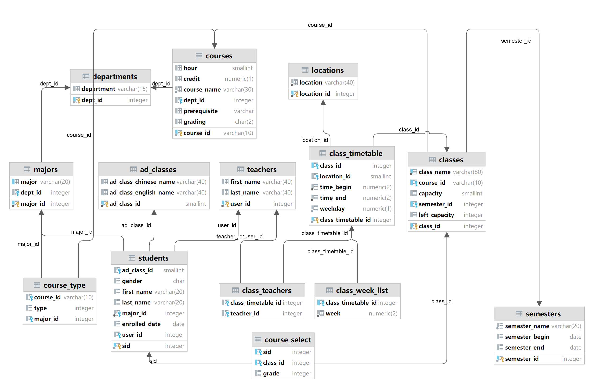
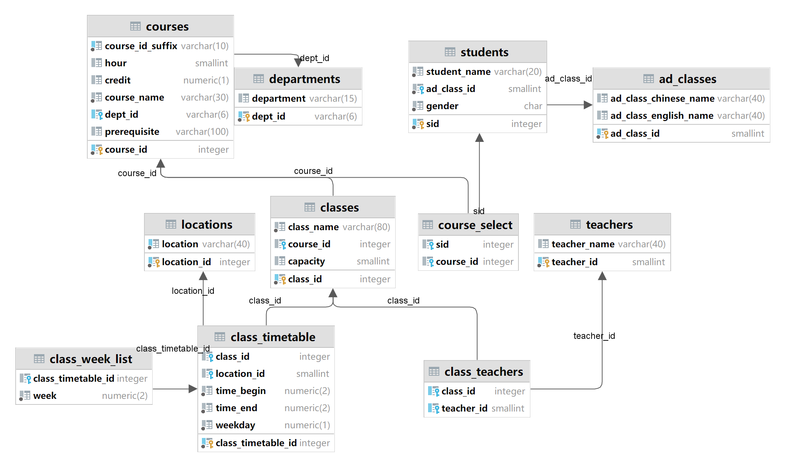

# CS213 Project Report
by 12110631 龚凌琥

## Database Structure
### Task 5 Database

以下为表的大致功能介绍。Task6完成的接口中并未覆盖到所有的相关字段，存在一定量的冗余数据，可供以后进行接口拓展。

| Table           | Description                                                               | Foreign Key                    |
|-----------------|---------------------------------------------------------------------------|--------------------------------|
| courses         | 存储某个课程（对应接口`Course`）的相关数据                                                 | dept_id                        |
| classes         | 存储某个课程班级（对应接口`CourseSection`）的相关数据                                        | course_id, semester_id         |
| class_timetable | 存储某个课程班级课程时间（对应接口`courseSectionClass`）的相关数据                               | location_id, class_id          |
| class_teachers  | 存储某个课程班级课程时间的老师的相关数据，以联合主键`(class_timetable_id, teacher_id)`约束            | class_timetable_id, teacher_id |
| class_week_list | 存储某个课程班级课程时间的对应教学周的相关数据                                                   | class_timetable_id             |
| students        | 存储学生的相关数据                                                                 | ad_class_id, major_id, user_id |
| course_select   | 存储学生选课的相关数据                                                               | sid, class_id                  |
| teachers        | 存储老师（对应接口`Instructor`）相关的数据。考虑接口中`Instructor` 继承自 `User・, 主键记录为 `user_id` | N/A                            |  
| ad_classes      | 存储学生行政班对应的信息。由于原始数据`student.csv`中行政班具有中英文名，分为两个字段记录。                      | N/A                            |
| departments     | 存储学校院系的相关数据                                                               | N/A                            |
| majors          | 存储学校专业的相关数据                                                               | dept_id                        |
| course_type     | 存储某个专业划分某个课程的课程类型的相关数据                                                    | course_id, major_id            |
| semesters       | 存储学期的相关数据                                                                 | N/A                            |
| locations       | 存储地点的相关数据                                                                 | N/A                            |

接下来对列的特殊考虑进行描述。

- `classes.left_capacity`: 在最开始的设计中，考虑到剩余课程容量可以通过聚合函数从`course_select`中计算得出，属于派生属性，并未考虑实际存在。但在进行接口实现时，发现实际上`course_select`表的数据量非常巨大，并且`addEnrolledCourseWithGrade`接口登记的学生课程不占用课程容量，使用聚合函数进行统计时造成了很大的性能瓶颈，因此考虑使用空间换取时间，在进行课程登记的时候更新该字段。

### Task 1 Database

相比Task5中的数据库，Task1的数据库缺少了以下表：
- semesters: 学期数据
- majors: 专业信息
- course_type: 专业对课程的分类

某些表中缺省了以下字段：
- students: `major_id`, `first_name`, `last_name` (`name`被合并为`student_name`), `enrolled_date`
- teachers: `first_name`, `last_name`(`name`被合并为`teacher_name`)

同时某些表添加了以下字段
- courses.course_id_suffix: 由于南科大课程id的字母前缀带有开课院系信息，课程id的前缀或许会成为冗余数据，在Task1设计数据库时我尝试将课程id拆分为院系id和课程id后缀（如`CS102A->{dept_id: CS, course_id_suffix: 102A}`），同时使用联合联合主键限制课程id唯一。但后续的接口开发中发现保证课程id的完整性更有助于编写代码，遂在Task5修改数据库的过程中保留了完整的`course_id`。

此外，`class_teachers`中的外键约束也从指向`class_timetable_id`改为`class_id`，因为`course_info.json`中并没有对课程时间进行老师的区分。

## Data Importer Design